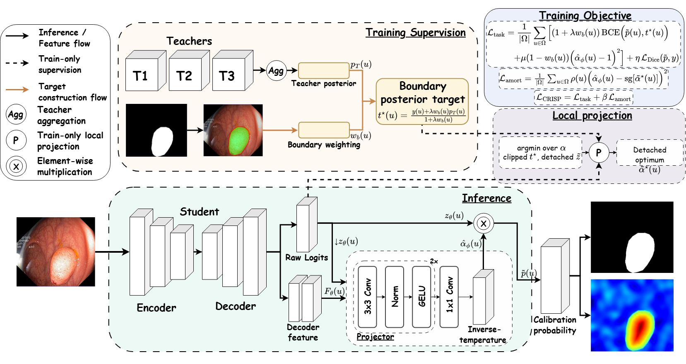
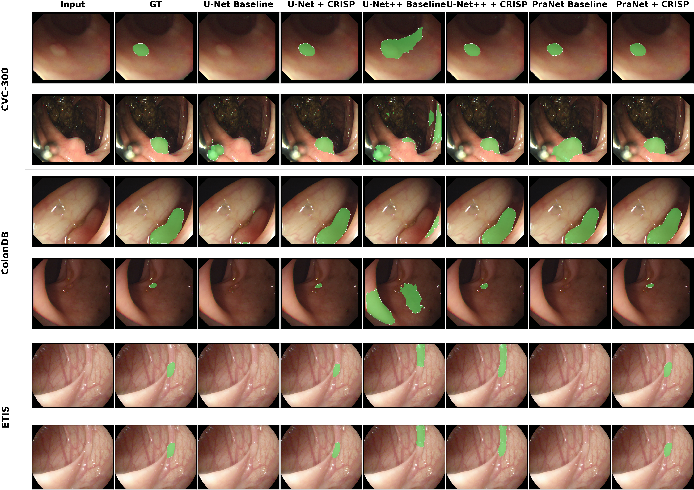
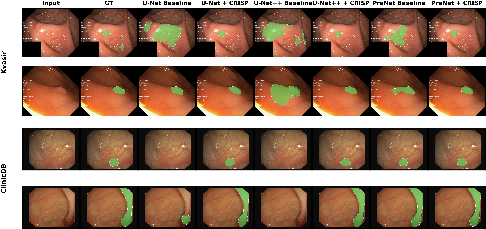

# CRISP

**CRISP: Amortized Boundary Posterior Projection for Calibrated Dense Prediction under Cross-Dataset Shift**

CRISP is the official research repository for constrained boundary-posterior
projection in binary polyp segmentation. It combines boundary-local teacher
supervision with a bounded, per-pixel inverse-temperature projection, then
amortizes that projection with a lightweight head for single-pass deployment.

## Overview

The repository provides current CRISP implementations for U-Net, U-Net++, and
PraNet students; strict source and evaluation membership controls; segmentation
and calibration metrics; checkpoint selection; and byte-linked run, checkpoint,
evaluation, and export provenance.

The codebase implements the method and its protocol gates. Datasets, exact
membership manifests, pretrained artifacts, trained checkpoints, and complete
raw per-seed metric artifacts are not committed to this repository.

## Method

During training, CRISP follows this path:

```text
source image
  -> student raw foreground logit z and backbone-specific dense feature tap F_b
  -> frozen teacher consensus p_T
  -> boundary-posterior target t*
  -> detached constrained optimum alpha*
  -> amortized projector alpha_hat(F, z)
  -> task loss + amortization loss
```

At deployment, the teachers and numerical solver are absent:

```text
image
  -> host-specific dense feature tap F_b and original full-resolution raw logit z
  -> bounded projector alpha_hat
  -> sigmoid(alpha_hat * z)
```

Because `alpha_hat` is positive and bounded, multiplying a fixed logit field by
it preserves the hard decision at probability threshold 0.5. Any geometry change
therefore comes from training-time learning, not from threshold changes during
deployment. See [the method notes](docs/method.md) for the implementation map.



*CRISP overview figure from the manuscript. The teacher icons denote a generic
M-teacher pool; the default experiments use M=2 with UACANet-L and Polyp-PVT.
Teachers, boundary weighting, and the local solver are training-only, while
deployment retains the student and amortized projector.*

## Repository status

| Surface | Status |
|---|---|
| CRISP training and deployment for U-Net, U-Net++, and PraNet | Implemented and test-gated |
| Matched `beta=0`, Margin Label Smoothing, and BWCR controls | Implemented for their declared hosts |
| Global Temperature Scaling | Mechanism implemented; real fitted artifacts are not bundled |
| Local Temperature Scaling | Intentionally blocked because a target-blind current-protocol definition is not specified |
| Source and evaluation protocol guards | Implemented; current runs require explicit manifests |
| Manuscript-result evidence | Incomplete without the external manifests, checkpoints, and raw per-seed artifacts |

## Installation

Python 3.10 is the pinned reference environment in `environment.yml`;
`pyproject.toml` declares Python `>=3.10`.

```bash
conda env create -f environment.yml
conda activate crisp
pip install -e .
```

Alternatively, in an existing compatible environment:

```bash
pip install -r requirements.txt
pip install -e .
```

## Data and membership manifests

The current protocol uses the canonical scientific dataset identities
`Kvasir-SEG`, `CVC-ClinicDB`, `CVC-300`, `CVC-ColonDB`, and `ETIS`. The storage
folder aliases `Kvasir` and `ETIS-LaribPolypDB` are accepted and canonicalized;
they are not the manuscript dataset names.

The legacy local/debug layout is:

```text
data/
|-- TrainDataset/
|   |-- image/ or images/
|   `-- mask/  or masks/
`-- TestDataset/
    |-- Kvasir/
    |-- CVC-ClinicDB/
    |-- CVC-300/
    |-- CVC-ColonDB/
    `-- ETIS-LaribPolypDB/
```

Current-protocol runs do not derive membership from a random seed, directory
order, or validation fraction. They require:

- an explicit source-root mapping for Kvasir-SEG and CVC-ClinicDB;
- one explicit source-training manifest;
- one explicit source-validation manifest; and
- one explicit evaluation manifest for each of the five canonical datasets.

Each manifest contains one dataset-qualified image/mask stem per line, for
example `Kvasir-SEG/<image_id>`. The current source count profile validates
`810 + 495` training samples and `90 + 55` validation samples from Kvasir-SEG
and CVC-ClinicDB, respectively. Evaluation manifests are validated against
counts of 100, 62, 60, 380, and 196 in the canonical dataset order above.
Membership is validated for duplicates, unknown IDs, image-mask completeness,
disjointness, complement coverage, dataset identity, and normalized-content
SHA-256.

The retained current-protocol configs declare manifest mode while intentionally
leaving the source manifest paths `null`; the evaluation map is supplied at
runtime:

```yaml
source_data:
  source_split:
    mode: manifest
    count_profile: current_crisp
    train_manifest: null
    val_manifest: null

eval:
  membership_count_profile: current_crisp
# Supply eval.membership_manifests at runtime.
```

Supply authorized manifest paths as runtime overrides. The historical
`thesis_*` filenames are retained for command compatibility; configs declaring
`protocol_profile: current_crisp` implement the current CRISP protocol.

`bash scripts/verify_data.sh --root "$CRISP_DATA_ROOT" --non-strict` checks only
the local/debug directory layout and image-mask pairing. It does **not** prove
that current-protocol membership manifests exist or are valid.

Additional setup details are in [docs/datasets.md](docs/datasets.md).

## Required pretrained artifacts

CRISP training requires strict-load checkpoints for the default frozen teacher
pool:

- UACANet-L;
- Polyp-PVT; and
- the upstream PVT-v2-B2 pretrain used while constructing Polyp-PVT.

Set the teacher paths explicitly:

```bash
export CRISP_TEACHER_UACANET_L_CKPT="$UACANET_L_CHECKPOINT"
export CRISP_TEACHER_POLYP_PVT_CKPT="$POLYP_PVT_CHECKPOINT"
```

The Polyp-PVT adapter also expects the PVT-v2-B2 file at
`1_baseline/Polyp-PVT/pretrained_pth/pvt_v2_b2.pth`. Optional student
initialization checkpoints can be supplied with:

```text
student_init.checkpoint=<student-checkpoint>
student_init.strict=true
```

The following are author-supplied external locations. Their public availability
and exact contents have not been verified by the repository evidence pipeline;
verify them before relying on them:

- [training dataset location](https://drive.google.com/file/d/1lODorfB33jbd-im-qrtUgWnZXxB94F55/view)
- [evaluation dataset location](https://drive.google.com/file/d/1o8OfBvYE6K-EpDyvzsmMPndnUMwb540R/view)
- [pretrained and experiment artifact location](https://drive.google.com/drive/folders/1pTjVGKuJmxK1aGacp7O_WnsbtfngoI2Q?usp=drive_link)

No artifact SHA-256 values are published here because the referenced bytes were
not available for verification in this checkout.

## Training

Before any current-protocol training command, set `CRISP_DATA_ROOT`,
`KVASIR_SOURCE_ROOT`, `CVC_CLINICDB_SOURCE_ROOT`, `SOURCE_TRAIN_MANIFEST`, and
`SOURCE_VAL_MANIFEST` to real local paths. Each source root must identify that
dataset's paired `image`/`images` and `mask`/`masks` directories. CRISP commands
additionally require the teacher variables above and a writable output location.

```bash
COMMON_SOURCE_OVERRIDES=(
  "+source_data.source_split.datasets.Kvasir-SEG.root=$KVASIR_SOURCE_ROOT"
  "+source_data.source_split.datasets.Kvasir-SEG.image_dir_candidates=[image,images]"
  "+source_data.source_split.datasets.Kvasir-SEG.mask_dir_candidates=[mask,masks]"
  "+source_data.source_split.datasets.CVC-ClinicDB.root=$CVC_CLINICDB_SOURCE_ROOT"
  "+source_data.source_split.datasets.CVC-ClinicDB.image_dir_candidates=[image,images]"
  "+source_data.source_split.datasets.CVC-ClinicDB.mask_dir_candidates=[mask,masks]"
  "source_data.source_split.train_manifest=$SOURCE_TRAIN_MANIFEST"
  "source_data.source_split.val_manifest=$SOURCE_VAL_MANIFEST"
)

# U-Net
bash scripts/train_thesis_unet_baseline.sh "${COMMON_SOURCE_OVERRIDES[@]}"
bash scripts/train_thesis_unet_crisp.sh "${COMMON_SOURCE_OVERRIDES[@]}"

# U-Net++
bash scripts/train_thesis_unetpp_baseline.sh "${COMMON_SOURCE_OVERRIDES[@]}"
bash scripts/train_thesis_unetpp_crisp.sh "${COMMON_SOURCE_OVERRIDES[@]}"

# PraNet
bash scripts/train_thesis_pranet_baseline.sh "${COMMON_SOURCE_OVERRIDES[@]}"
bash scripts/train_thesis_pranet_crisp.sh "${COMMON_SOURCE_OVERRIDES[@]}"
```

The current experiment configs declare the five-seed protocol
`{2026, 2027, 2028, 2029, 2030}`. Individual wrapper invocations run the selected
`seed`; they do not automatically iterate the five values. Runs fail before
training if required manifests, teacher checkpoints, or other strict artifacts
are absent or incompatible. Full training is intentionally not run as part of
repository validation.

## Evaluation

Evaluation requires a real checkpoint, the data root, and all five exact
evaluation manifests. Set these variables to real paths before running:

```bash
EVAL_MEMBERSHIP_OVERRIDES=(
  "+eval.membership_manifests.Kvasir-SEG=$KVASIR_SEG_MANIFEST"
  "+eval.membership_manifests.CVC-ClinicDB=$CVC_CLINICDB_MANIFEST"
  "+eval.membership_manifests.CVC-300=$CVC_300_MANIFEST"
  "+eval.membership_manifests.CVC-ColonDB=$CVC_COLONDB_MANIFEST"
  "+eval.membership_manifests.ETIS=$ETIS_MANIFEST"
)

CRISP_EVAL_CONFIG=experiment/thesis_unet_crisp \
  bash scripts/eval_thesis_unet.sh "$CHECKPOINT" "${EVAL_MEMBERSHIP_OVERRIDES[@]}"
```

Use `experiment/thesis_unet_baseline`, `experiment/thesis_unetpp_baseline`,
`experiment/thesis_unetpp_crisp`, `experiment/thesis_pranet_baseline`, or
`experiment/thesis_pranet_crisp` with the matching host script and checkpoint.
CRISP evaluation records projector-on and projector-off metrics; baseline
evaluation has no projector.

Validation checkpoint selection is exact and order-independent: maximize B-F1;
among epochs within 0.002 of the global maximum, choose lower bECE, then higher
mDice, then the earliest epoch.

## Implemented controls

- **Matched `beta=0`:** uses the same student, teachers, target, projector,
  solver, task objective, schedule, and diagnostics as full CRISP; only the
  amortization coefficient is zero. Configs exist for U-Net, U-Net++, and PraNet.
- **Margin Label Smoothing:** adds the binary margin penalty with `m=10` and
  weight `0.1` to the host baseline objective. It is implemented for U-Net and
  PraNet and applies to PraNet's final logit while preserving native side
  supervision.
- **Boundary Weighted Logit Consistency (BWCR):** uses two independently
  transformed source views, inverse-aligns their final raw logits, and applies
  the native linear distance weighting with `lambda_min=0.01`, `lambda_max=1`,
  and radius `10`. It is implemented for U-Net and PraNet, uses no target-domain
  labels or target statistics, and introduces no target-time consistency
  machinery; target inference remains one ordinary student forward pass.
- **Global Temperature Scaling:** fits a positive scalar on frozen source
  validation logits in `crisp.scripts.posthoc_calibrate`. The mechanism is
  available, but no real fitted result artifact is bundled.
- **Local Temperature Scaling:** the retained target-dependent diagnostic is
  quarantined. The public/current path raises before output creation because the
  manuscript does not specify a target-blind application contract.

Control configs are under `configs/experiment/`. U-Net++ Margin Label Smoothing
and BWCR configs are intentionally absent because those hosts were not declared
for these controls.

## Metrics

The primary reported metrics are:

- `mDice` and `mIoU` for region overlap;
- `B-F1` for boundary agreement;
- `HD95` for boundary distance; and
- `bECE` for boundary-support calibration.

The evaluator also exposes `off-bECE`, `ECE`, `BA-ECE`, `TACE`, global Brier and
NLL, and canonical-support boundary Brier and boundary NLL. The bECE support is
selected per image and pooled across the dataset; boundary Brier/NLL retain the
fixed canonical 20% support independently of bECE sensitivity settings.

## Reproducibility and provenance

Current runs bind scientific identity to the resolved config SHA-256, Git SHA,
source manifest hashes, student initialization bytes, and teacher checkpoint
bytes. Checkpoints link to the exact run ID and selection record. Evaluations
bind the checkpoint byte SHA-256, evaluation config, mode, dataset identity, and
exact evaluation-membership SHA-256. Export rows preserve those links and reject
path-versus-provenance conflicts.

This machinery records and validates real artifacts; it does not turn a config
or a manuscript table into evidence that a run completed. The exporter emits one
traceable row per evaluator artifact and does not invent seed aggregation or
confidence intervals.

## Manuscript-reported results

The compact landing page intentionally omits the large result tables. They are
available in [docs/experiments.md](docs/experiments.md) and are explicitly marked
as manuscript-reported values. Complete linked raw run artifacts are not present
in this repository, so those tables are not marked as independently verified by
the repository evidence pipeline.

## Qualitative examples



*Representative unseen-domain qualitative comparison from the manuscript.
Examples were selected after evaluation using baseline-difficulty, lesion-size,
and contrast strata, independently of the CRISP improvement magnitude.*



*Seen-domain qualitative comparison on Kvasir-SEG and CVC-ClinicDB from the
manuscript, using the same predeclared selection rule as the unseen-domain panel.*

These are static manuscript figures included for visual reference. The current
repository does not yet contain the complete linked raw artifact-generation
pipeline required to independently regenerate them.

## Repository structure

```text
configs/              Hydra experiment, model, data, teacher, and metric configs
scripts/              Training, evaluation, verification, and export entry points
src/crisp/            CRISP package source
src/crisp/data/       Dataset membership and image-mask loading
src/crisp/engine/     Training, checkpoint selection, and evaluation
src/crisp/metrics/    Segmentation and calibration metrics
src/crisp/models/     Student, teacher, adapter, and projector modules
src/crisp/modules/    Boundary, posterior, solver, calibration, and control losses
tests/                Scientific invariant and integration tests
docs/                 Method, dataset, and experiment documentation
1_baseline/           Retained upstream source required for model compatibility
```

## Citation

Please cite the current manuscript:

```bibtex
@unpublished{vo_crisp,
  author = {Ngoc-Khue Nguyen Vo and Thanh-Trung Huynh and Huy-Hieu Pham and Viet-Sang Dinh},
  title = {CRISP: Amortized Boundary Posterior Projection for Calibrated Dense Prediction under Cross-Dataset Shift},
  note = {Manuscript},
  url = {https://github.com/Khue-0408/CRISP}
}
```

A DOI and publication year are intentionally omitted until authoritative
publication metadata is available. Machine-readable repository metadata is in
[CITATION.cff](CITATION.cff).

## License and third-party code

CRISP-authored code is released under the [MIT License](LICENSE). The
`1_baseline/` tree contains retained upstream implementations needed for model
and checkpoint compatibility. Upstream license or notice files are preserved
where they are included (notably UACANet and U-Net++); other retained components
remain subject to their upstream terms. Review those upstream repositories and
terms before redistribution or commercial use.
